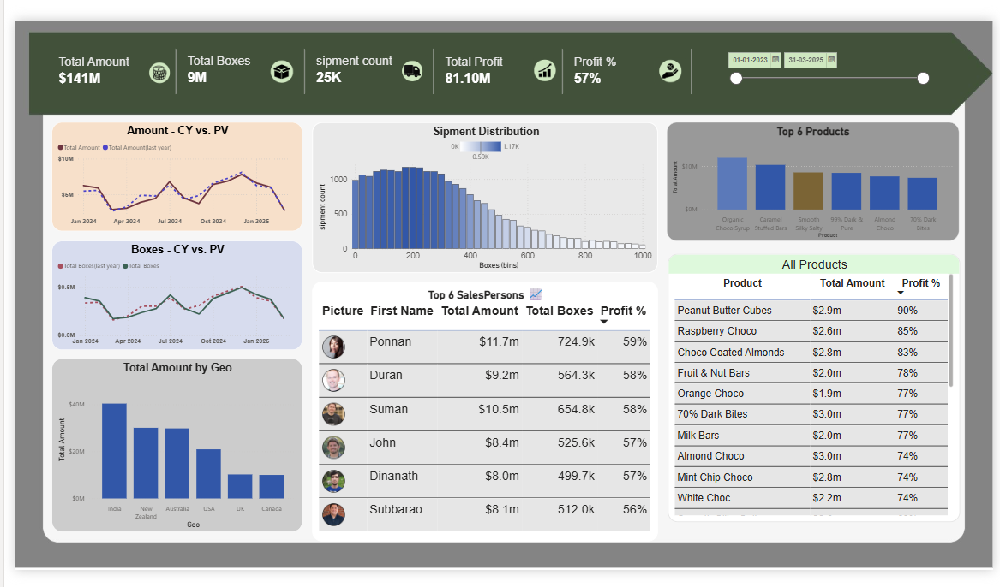

# 🍫 Power BI Sales Analytics — Chocolate Dashboard

A self-practice project applying core Power BI workflows to a chocolate sales dataset.

## 🛠️ Skills Practiced

- **Data Cleaning (Power Query)** — shaping raw shipment, product, and calendar data for analysis
- **Data Modeling** — connecting fact and dimension tables into a working schema
- **DAX** — writing measures for revenue, profit %, and YoY comparisons
- **Visualization** — combining KPIs, trend lines, tables, and slicers into one dashboard

## 🎯 Purpose

A learning exercise to go from raw spreadsheet data to a polished, interactive report — end to end in Power BI.

## ▶️ Usage

Open `Chocolate_Sales_Dashboard.pbix` in Power BI Desktop to explore.
